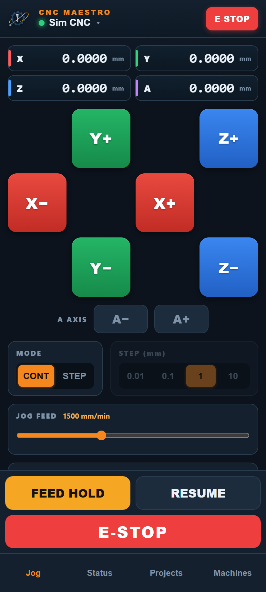
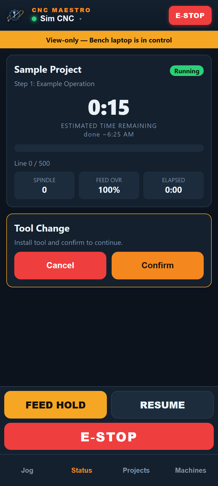
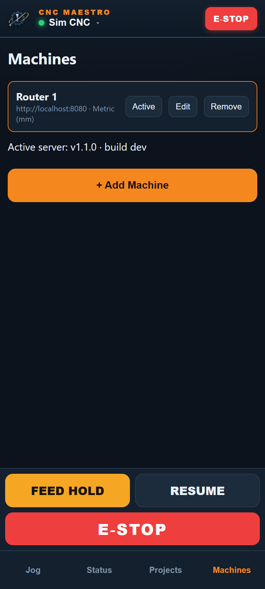

# CNC Maestro Remote — Mobile Companion Guide

Monitor and control your CNC from your phone over the shop Wi‑Fi. The companion is a
**Progressive Web App (PWA)** served directly by the Maestro plugin — there is nothing to
install from an app store, and no cloud account. Your phone talks straight to the shop PC on
the local network.

| Jog | Status (job + prompt) | Machines |
|-----|-----------------------|----------|
|  |  |  |

---

## What you can do

- **Jog** X / Y / Z / A in step or continuous (dead‑man) mode.
- See **live DROs**, homing state, and machine status.
- **Home All**, **Auto‑Zero** (fixed‑plate probe), and **Park**.
- Start the spindle at a chosen RPM for setup (edge‑finding, tramming).
- Run **Maestro projects**: pick a project, Run All / Run Step / Reset / Abort, and watch
  job progress (current step, progress bar, time remaining, finish‑time estimate).
- **Confirm or cancel tool‑change and gate prompts** from your phone.
- **Feed Hold**, **Resume**, and **E‑STOP** are always one tap.
- Manage **multiple machines** (add / connect / rename / remove), each with its own units.

---

## Requirements

- The shop PC runs UCCNC with the Maestro plugin installed and enabled.
- Your phone and the PC are on the **same Wi‑Fi**, and that network is set to **Private**
  in Windows (not Public).
- A modern mobile browser (Safari on iOS, Chrome on Android).

---

## One‑time setup on the shop PC

1. **Install the plugin** (see the main [README](../../README.md)) and enable it in
   UCCNC → *Configuration → Plugins → UccncMaestro* with *Call startup* checked. Restart
   UCCNC so the Maestro window opens.

2. **Open network access.** By default Windows blocks inbound connections and the server
   can only bind to `localhost` (so phones can't reach it). You have three options:

   - **Packaged installer (easiest).** Leave **“Allow phones on the Wi‑Fi to connect”**
     checked in the setup window (it’s on by default), then click *Install*. Approve the
     UAC prompt. For an unattended install add `-EnableLan` (and optionally `-Port 8723`).
   - **From the repo**, run **once** (raises a UAC prompt):

     ```powershell
     .\make.ps1 net-setup
     ```

   Either path reserves the HTTP URL so the plugin can listen on all LAN interfaces, and
   opens an inbound firewall rule for the companion port (default **8723**) on **all**
   network profiles (incl. Public, since shop Wi‑Fi is often marked Public).

   <details><summary>Prefer to do it by hand?</summary>

   Run these in an **elevated** PowerShell:

   ```powershell
   netsh http add urlacl url=http://+:8723/ sddl="D:(A;;GX;;;WD)"
   netsh advfirewall firewall add rule name="UccncMaestro Companion (TCP 8723)" `
     dir=in action=allow protocol=TCP localport=8723 profile=any
   netsh advfirewall firewall add rule name="UccncMaestro Discovery (UDP 8723)" `
     dir=in action=allow protocol=UDP localport=8723 profile=any
   ```

   `profile=any` matters: shop PCs often leave the Wi‑Fi marked **Public**, and a
   Private/Domain‑only rule would silently drop phone traffic (the page just hangs).
   The **UDP** rule enables LAN auto‑discovery (machines find each other); it's optional
   — without it you can still add machines by IP.
   </details>

3. **Restart UCCNC** so the server re‑binds to the LAN.

4. On the Maestro window's **Mobile** tab, note the **address** (e.g.
   `http://192.168.1.185:8723/`) and the **pairing PIN**. If it still shows a `localhost`
   URL or a "LAN bind failed" message, step 2 hasn't taken effect yet.

---

## Connecting your phone

1. On the phone's browser, go to the address shown on the Mobile tab, e.g.
   `http://192.168.1.185:8723/`.
2. **Add to Home Screen** so it runs full‑screen like a native app:
   - **iOS (Safari):** Share → *Add to Home Screen*.
   - **Android (Chrome):** ⋮ menu → *Install app* / *Add to Home screen*.
3. Open the app → **Machines** tab → **+ Add Machine**:
   - Enter the PC's **IP address** and **port** (8723).
   - Choose the machine's **units** — **Metric (mm)** or **Imperial / SAE (in)**. This must
     match how UCCNC is configured on that machine.
   - Set **this device's name** (e.g. "Patrick's iPhone"). It's how other phones see you when
     you hold control — they'll show "View‑only — Patrick's iPhone is in control".
   - Tap **Next**, then enter the **PIN** from the Mobile tab to pair.

The machine is saved on your phone with a secure token; you won't need the PIN again unless
it's rotated.

---

## Using the app

### Jog


- **DRO cluster** (top): X / Y / Z / A work positions. A ⚠ next to an axis means it isn't
  referenced (homed) yet.
- **Jog pad**: the X/Y cross is the primary control; **Z** is an equally‑sized column beside
  it. **A** is a small secondary control below (most machines don't use it).
- **MODE**: choose **CONT** (continuous) or **STEP**. *Continuous is the default* — press and
  hold a button to move, release to stop. In **STEP** mode each tap moves one increment, and
  the **STEP** selector picks the distance.
- **JOG FEED** slider sets jog speed (mm/min or in/min depending on the machine's units) for
  **both** step and continuous jogging — continuous jog moves at this feed, not a fixed rate.
- **SPINDLE** slider sets a target RPM; **hold** the toggle to turn the spindle **ON** (a
  deliberate hold, since it spins a tool), tap to turn it **OFF**. Dragging the slider while
  it's running changes the speed live. *(Disabled while a job is running.)*
- **Home All / Auto‑Zero / Park**: press‑and‑**hold** to confirm (avoids accidental motion).
- The **Feed Hold / Resume / E‑STOP** bar is pinned at the bottom of every screen.

### Status


- Project name and current step, with a **Running / Idle / Feed Hold / E‑STOP** badge.
- **Big clock** shows estimated time remaining and the projected finish time
  ("done ~6:05 AM"), plus a progress bar (by g‑code line, or time when line count is unknown).
- Live **spindle RPM**, **feed override**, and **elapsed** time.
- **Tool Change / operator prompts** appear here with **Confirm / Cancel** so you can respond
  without walking to the machine.
- If another phone (or the PC) holds control, an amber **"View‑only — &lt;device&gt; is in
  control"** banner appears (using that device's name) — you still see everything, and
  E‑STOP / Feed Hold still work.

### Projects

- Pick the active project, see its step list (status, tool, last runtime), and run
  **Run All**, a single **Run** per step, **Reset**, or **Abort** (hold‑to‑confirm).

### Machines


- **Connect/Active**, **Edit** (rename + change units), **Remove**, and **+ Add by IP address**.
- **Found on your network** lists other Maestro machines discovered automatically on the
  LAN — tap **Connect** to add one (you'll confirm units and pair as usual). Use **Rescan**
  after powering a machine on. Discovery needs the inbound **UDP** firewall rule (added by
  the installer); if it's missing, machines won't appear but you can still add them by IP.
- The footer shows the **active server version and build** so you can confirm a device is
  talking to the build you expect.

---

## Units (SAE vs metric)

Units are a **per‑machine** setting chosen when you add a machine (and changeable via
**Edit**). When a machine is set to **Imperial / SAE**:

- DROs read in **inches**, step presets become **0.001 / 0.01 / 0.1 / 1 in**, and the jog
  feed is **in/min**.
- Metric machines use **mm**, **0.01 / 0.1 / 1 / 10**, and **mm/min**.

Each unit system remembers its own step/feed, so switching machines won't scramble settings.
Make sure the app's units match the machine's actual UCCNC configuration.

---

## Safety

- **E‑STOP** and **Feed Hold** always work, from any paired phone, and bypass control locks.
- Only one phone holds **control** at a time; others are read‑only until they take control.
- Continuous jog is **dead‑man**: motion stops the moment you release, switch apps, or lose
  connection (a server watchdog also stops it if keepalives stop).
- Destructive actions (Home, Auto‑Zero, Park, Run, spindle ON) require a deliberate
  press‑and‑hold.

This is a **LAN‑only** tool. Do not port‑forward or expose the companion port to the
internet.

---

## Troubleshooting

**Phone can't connect / page just hangs**
- **Type the address with `http://`** — `http://<LAN‑IP>:8723/`. A bare address makes most
  phone browsers try **HTTPS**, which the server doesn't speak, so the page hangs. In
  Chrome turn off *Settings → Privacy and security → “Always use secure connections.”*
- Re-run the installer with **“Allow phones on the Wi‑Fi to connect”** checked (or
  `.\make.ps1 net-setup` from the repo, elevated) and **restart UCCNC**. Without the URL
  ACL the server falls back to `localhost` only; the firewall rule now covers **all**
  network profiles (incl. Public).
- If the PC reaches itself but other devices still can't, the block is on the **network**:
  disable the router's **AP/client isolation** (common on mesh/guest Wi‑Fi) and make sure
  the phone is on the **same SSID** (not a guest network).
- **“Bad Request – Invalid Hostname”** from the phone means the server bound to `localhost`
  only (the URL ACL wasn't present when UCCNC started). Re‑run the installer with the Wi‑Fi
  option checked, then **restart UCCNC**.
- Confirm the Mobile tab shows a `http://<LAN‑IP>:8723/` address, not `localhost`.

**The UI looks like an older version**
- Your browser cached the previous app shell. **Hard‑refresh twice** (the first reload
  installs the updated service worker, the second serves it), or remove and re‑add the
  home‑screen app, or clear the site's data.
- Verify what you're actually running: **Machines** tab shows
  `Active server: v<version> · build <id>`; compare the build id to the `Build id:` printed
  during `make.ps1 install`. You can also open `http://<IP>:8723/api/info` in a browser.

**Updating** — rebuild and redeploy with `.\make.ps1 install` (close UCCNC first), restart
UCCNC, then hard‑refresh the phone once. The shipped service worker is network‑first, so
future updates appear after a single reload.

---

## Local testing (no machine)

Developers can exercise the whole app without UCCNC or a real machine:

```powershell
.\make.ps1 testhost            # serves the PWA + a simulated machine on localhost:8723
```

Open the printed URL, pair with the printed PIN, and the simulator responds to jog/zero/home/
park and runs simulated jobs with progress and prompts. See [OVERVIEW.md](OVERVIEW.md).
